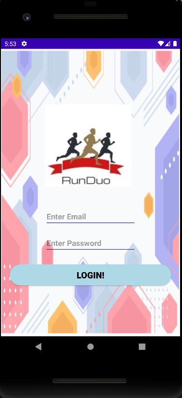
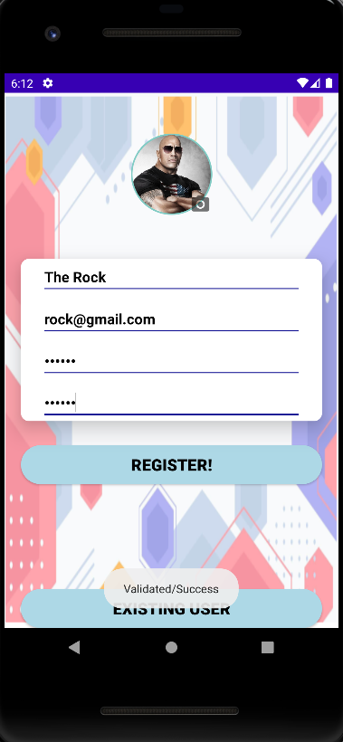
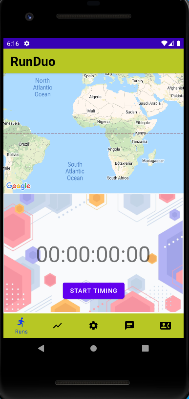
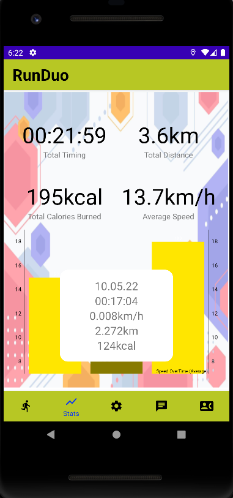
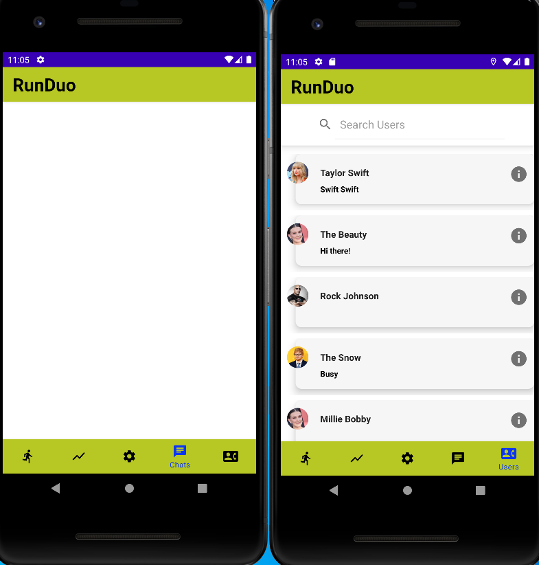
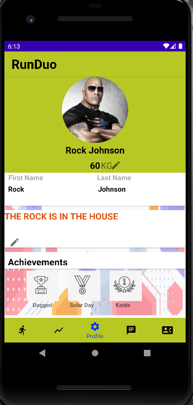
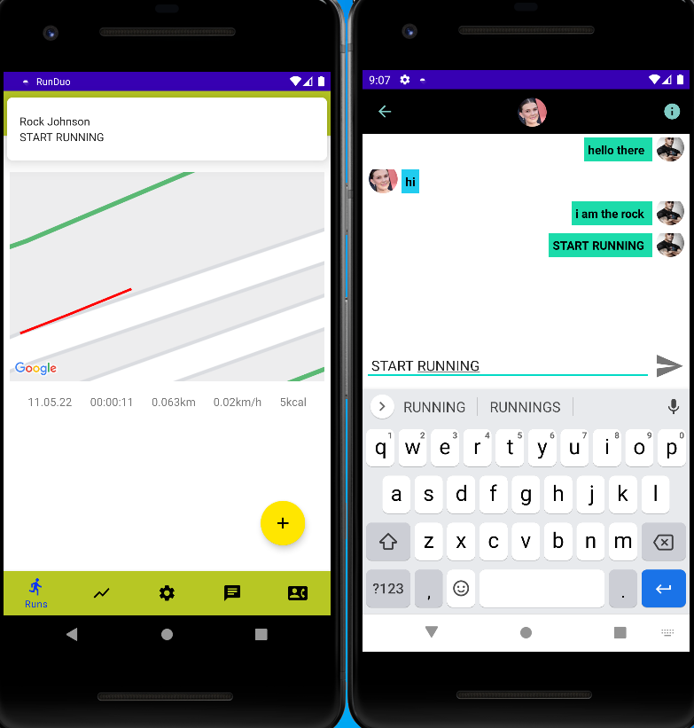
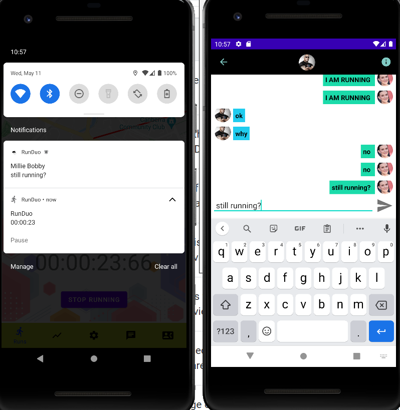
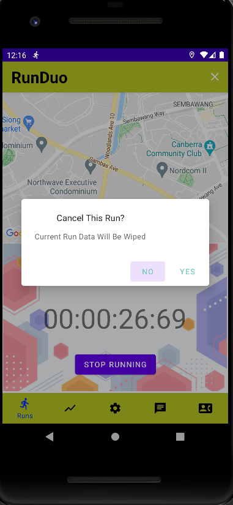

# RunDuo
This is a University Final Year Project in android mobile application that uses peer coaching and gamification to encourage users to go run more often.  
It is an application tracks user running start time as well as route with google maps. Additionally, it also enable users to communicate with one another via the chatting feature.  

## 📚 Functions
1. User account creation
2. Menu Navigations Bar
3. GPS location Tracking
4. Total Running Time , Distance and Average Pace
5. User Running Route and stopwatch
6. Achievements (Hard-coded for now)
7. Calories burned using user weight
8. Chatting function (Peer Coaching)
9. User Profile
10. Friend Profile
11. Notification for messenges

## 📱 Screenshots

  

 
 

## 💻 Tools
* **Software**: Android Studio
* **Authentication**: Firebase Authentication
* **Database**: Firebase Realtime Database

## 💬 Notes
Firebase Realtime Database has been set to private hence no further users can be registered or created, there is already some users in the database for testing purposes.
* **Testing Account**: id: rock@gmail.com pw:123456
